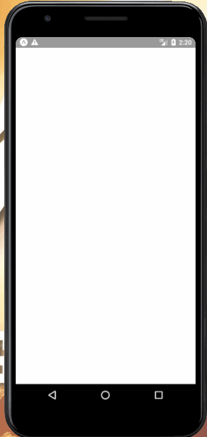
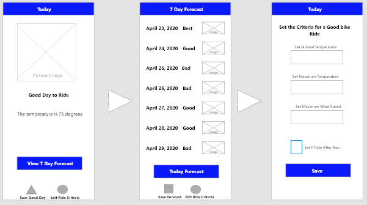

# Planning my Bike Ride

;

### Table of Contents
1. Purpose
2. Motivation
3. Objectives
4. Wireframe
5. How to play with Demo
6. How to Install
7. Technologies Used

### Purpose:
This is a bike riding app that assists the user in determining if today or the next 7 days is good for riding. 

### Motivation:

This project was used to practice developing with React Native, APIs, and unit testing.

### Objectives:
##### Original
- Application displays if today is a good day to ride.
- Application displays if the next 7 days is a good, bad, or the best day to ride.  
- The user can save the 7 day forecast to use later if there is no internet accesss
- The user can change the criteria of what a good day to ride is.
- The user can save the current weather to help the application learn and display what a "Great" day to ride is.

##### Based on User Feedback
- User can choose between Fahrenheit & Celsius
- Provide more details on what the "Save Good Day" feature does

### WireFrame

### How to play with Demo
1. Download the Expo app to your phone
2. Click on this link to view the app: https://expo.io/@jcsmileyjr/bike-ride 

### How to Install
1. On the command line, install expo: npm install -g expo-cli
2. Clone this repository to your local computer
3. On the commmand line and from the folder containing the app: npm install
4. On the command line, change directory to the bike-ride folder
5. Download the expo app to your mobile device
6. On the command line type: npm start
7. Using the broswer window that pops up, use your mobile device's camera to scan the QR code to launch the app.

### This app was built with the following technologies:

**React Native:** JavaScript mobile app framework

**Git-Hub:** Web-based version control repository and Internet hosting service

**React-Navigation:**  Navigation library for React’s web and mobile apps

**Native-Base:** Open source UI component library for React Native

**Abode XD:** A wire-framing tool used to create a mockup/visual of what is to be coded

**Jest:** A testing framework for unit testing.

**JavaScript:** Object-oriented programming language for web pages

**HTML:** Mark-up language for creating web pages

**CSS:** A formatting language for styling web pages

_Created by JC Smiley in May of 2020_
